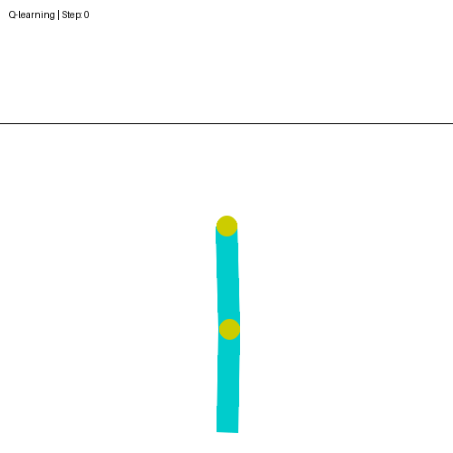

# Acrobot-v1 RL Comparison

A small reinforcement learning project that compares **Q-learning** and **SARSA** on OpenAI Gymnasium's classic control environment **Acrobot-v1** using a simple discretized state-value table.

The project is implemented as a single Jupyter notebook (`main.ipynb`) that trains both algorithms, plots learning curves, and generates GIFs of the learned policies.

## Q-Learning vs SARSA on Acrobot-v1

<table>
  <tr>
    <th>Q-Learning</th>
    <th>SARSA</th>
  </tr>
  <tr>
    <td align="center">
      
    </td>
    <td align="center">
      
    </td>
  </tr>
</table>


---

## What this project does

- Implements **Q-learning** and **SARSA** agents for the `Acrobot-v1` environment.
- Uses **state discretization** to convert continuous observations into a discrete state space.
- Compares learning performance via **learning curves** (returns over episodes).
- Generates **policy visualization GIFs** showing the agent controlling the Acrobot.

---

## Getting started

### 1) Clone the repo

```bash
git clone <your-repo-url> "Acrobot-v1"
cd "Acrobot-v1"
```

### 2) Create and activate a Python virtual environment (recommended)

```bash
python3 -m venv .venv
source .venv/bin/activate
```

### 3) Install dependencies

There is no `requirements.txt` in this repo, but the notebook depends on:

- `gymnasium` (Gymnasium v1 environment suite)
- `numpy`
- `matplotlib`
- `imageio`
- `Pillow`

Install the required packages:

```bash
pip install gymnasium numpy matplotlib imageio Pillow
```

### 4) Run the notebook

Start Jupyter and open `main.ipynb`:

```bash
jupyter notebook main.ipynb
```

Then run all cells in order. The notebook will:

1. Tune hyperparameters (learning rate, exploration rate) for both SARSA and Q-learning
2. Train each algorithm for multiple random seeds
3. Plot learning curves with confidence intervals
4. Generate GIFs of the learned policies (`sarsa_acrobot.gif`, `qlearning_acrobot.gif`)


